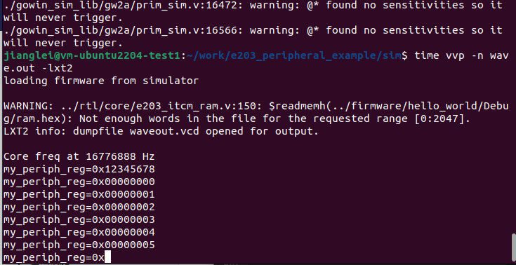

# e203_peripheral_example

This example shows how to add a custom module for e203 on icb bus.

## how to get the code

open a Linux ternimal, change directory to your work folder, then execute:

```shell
git clone https://git.tongji.edu.cn/intelli_chip_and_system_design_course/system_design/e203_peripheral_example.git
```
If there is any error, try login git.tongji.edu.cn in web browser first, and then try again.

## add my_periph_example rtl code

see "rtl/ip/my_periph_example.v".

In this module, a 32-bit register called "io_value_reg" was implemented for read or write data. This register is initialized to value of 0x12345678 after reset. This module is using original QSPI0 memory space whose base address is 0x1001 4000. The io_value_reg register is using 0x04 for offset address which is being defined in my_periph_example.v, line 50 and 52.

```
//for read
assign io_value_reg_rd_en = i_icb_cmd_valid && i_icb_cmd_read && (i_icb_cmd_addr[11:0] == 3'h4);
//for write
assign io_value_reg_wr_en = i_icb_cmd_valid && (~i_icb_cmd_read) && (i_icb_cmd_addr[11:0] == 3'h4);

```

## modified /rtl/core/e203_subsys_perips.v

See line 2572, add my_periph_example instance. This custom module is attach to channel 5 or "o5" of "sirv_icb1to16_bus", substituting original QSPI0 module. See line 1720 for details. Note that you need to modify or add some signal wire to match your instance signals.

## add C headers for my_periph_example module

"my_periph.h" is added to /firmware/hello_world/src/bsp/hbird-e200/include/headers/devices/, which defines offset address for your registers. Another modification needed in "/firmware/hello_world/src/bsp/hbird-e200/env/platform.h". line 21:
```
#include "headers/devices/my_periph.h"
```
and line 44:
```
#define MY_PERIPH_CTRL_ADDR     _AC(0x10014000,UL) 
```
and line 124:
```
#define MY_PERIPH_REG(offset)   _REG32(MY_PERIPH_CTRL_ADDR, offset)
```
were added to support our custom module. You can modify "/firmware/hello_world/src/bsp/hbird-e200/include/headers/devices/my_periph.h" to add support for your custom registers.

## a minor modification for makefile

add "TARGET" variable for bin file name.

no other modification needed for makefile(s), you can just run make to build demo program. Note that before rebuild, "make clean" is needed.

## what's going on in main.c

in demo program, the initial value of register in our custom module (0x12345678) was read out and then print out through uart0. You can see this value through vvp(iverilog) simulation. This shows the READ op is functional. Then an incremental value from 0 will be written into this register, also be read out and show.

## testbench modified for test code

The simulation period is 30ms, which will take about 6 minutes on ubuntu 22.04 environment in vmware (physical machine is an intel i7-13700kf desktop cpu @ ~5.1GHz). You can see the icb bus transaction with gtkwave.

Use "/sim/sim_run_sys_tb.sh" in linux environment to simulate. If you are going to run under windows, sim_run_sys_tb.cmd need to be modified according to linux shell script. See line 3 in "sim_run_sys_tb.sh".

## simulation result


