# 基于 RISC-V E203 的字符终端（HDMI + UART）

面向 Tang Primer 20K（GW2A-18）与 Dock 底板：在蜂鸟 E203 的 ICB 总线上挂接自定义终端外设，输出 HDMI（RGB565）彩条与黑白字符，从板载 USB-JTAG 的 UART（115200 8N1，3.3V）接收 ASCII 并显示。

## 功能概述
- 上电 5 秒彩条自检；随后进入文本模式，显示提示信息与提示符 `root@shen_kai:# `。
- 支持 640×480@60Hz，像素时钟约 18 MHz；字符缓冲 100×30（单色）。
- UART 输入（板载 USB-JTAG 的 UART 口，无需飞线），CR/LF 换行、Backspace/Delete、行末自动换行。
- ICB 寄存器读写 VRAM、清屏、FIFO 读、软件注入字符与中断。

## 目录结构
- `rtl/ip/fpga_terminal_icb.v`：终端顶层，ICB 外设封装、UART RX、字符状态机、光标/清屏逻辑。
- `rtl/ip/text_display.v`：字符到点阵渲染。
- `rtl/ip/font_rom.v`：内置 8×16 ASCII 字库。
- `rtl/ip/video_ram.v`：双口字符 RAM，含 `r_addr_6/r_data_6` 供 CSR 读。
- `rtl/ip/lcd_driver.v`：640×480 Timing 产生与坐标输出。
- `rtl/ip/uart_rx.v`：115200 8N1 UART 接收。
- `gowin_prj/e203_basic_chip.cst`：LCD/UART 等引脚约束（`lcd_r[2]` 改用 M9，UART RX 用 T13）。
- `firmware`：E203 演示软件（需生成 `ram.hex`）。
- `sim/iverilog-lnx`：Icarus 仿真脚本与 testbench。

## 硬件连接与引脚
- 板卡：Tang Primer 20K + Dock，USB-JTAG 供电/下载/UART。
- 串口：两个 COM 口，选择 UART 口（非 JTAG 口），115200 8N1，3.3V；复用 GPIO16(T13)。
- 显示（RGB565）：`lcd_dclk R9`, `lcd_hs A15`, `lcd_vs D14`, `lcd_de E15`, `lcd_r[4:0] L9 N8 M9 N7 N6`, `lcd_g[5:0] D11 A11 B11 P7 R7 D10`, `lcd_b[4:0] B12 C12 B13 A14 B14`。

## 时钟与显示
- 输入基准：27 MHz；内部生成像素时钟约 18 MHz 用于 640×480@60Hz。
- 彩条时间：约 5 秒。
- PLL 设备型号：设为 GW2A-18，避免错误警告。

## ICB 寄存器映射（默认基址 0x1001_4000，槽 o5）
- 0x000 ID (R)：0x46505431。
- 0x004 STATUS (R)：`[15:8] fifo_data`，`[0] fifo_valid`，`[16] bar_active`，`[23] ctrl_irq_en`。
- 0x008 RXPOP (R)：弹出 FIFO 顶元素（空则 0）。
- 0x00C CTRL (R/W)：`[1] auto_inc`，`[2] irq_en`，`[0] clear=1` 触发清屏。
- 0x010 CURSOR (R/W)：`cursor_y[12:8], cursor_x[6:0]`。
- 0x014 VADDR (R/W)：VRAM 地址 0~2999。
- 0x018 VWDATA (W)：写 VRAM 字符，可自增。
- 0x01C VRDATA (R)：读 VRAM 字符。
- 0x020 CHARIN (W)：软件注入字符到 RX FIFO。
- 0x024 IRQSTS (R/W1C)：bit0 irq_pending，写 1 清除。

## 终端行为
- 上电：彩条→信息行→清屏→提示符。
- 输入：UART/FIFO 字符逐字显示；CR/LF 换行；Backspace/Delete 删除；行末自动换行，满屏循环。
- 中断：FIFO 非空且 irq_en=1 置位 irq_pending，写 IRQSTS 清除。

## 构建与烧录流程（Linux）
1. `cd firmware/hello_world && make clean && make` 生成 `ram.hex`（或你的应用目录）。
2. 确认 FPGA 工程引用了最新 `ram.hex`（ROM 初始化）。
3. Gowin IDE 综合/P&R：器件选 GW2A-18，Dual-Purpose Pin 保持 JTAG/MSPI 默认，SSPI 未用可关。
4. 导出 bit/FS，使用 USB-JTAG 通过 Gowin Programmer 或 openFPGALoader 烧录。
5. 上电/复位验证：彩条→信息行→清屏→提示符；串口 115200 8N1 输入字符检查显示、换行、退格；可读 STATUS/IRQSTS 检查 FIFO/中断。

## 仿真（Icarus + GTKWave）
- 目录：`sim/iverilog-lnx`。
- 编译脚本：`sim_run_sys_tb.sh` 已加入终端 IP 文件。
- Testbench：`sys_tb_top.sv` 通过 `gpio_in[16]` 发送 UART 样例（ABC\r\n，可按需修改 `send_uart_byte` 调用）。
- 运行：
  ```bash
  cd sim/iverilog-lnx
  bash sim_run_sys_tb.sh   # 编译 wave.out
  vvp wave.out             # 生成 waveout.vcd
  gtkwave waveout.vcd &    # 打开波形
  ```
- 关注信号：`term_uart_rx`；`pop_req/pop_ack/fifo_empty/fifo_rdata/write_en/write_addr/write_data/cursor_x/cursor_y/state`；`lcd_dclk/lcd_hs/lcd_vs/lcd_de`。
- 仿真过程截图：  
  - 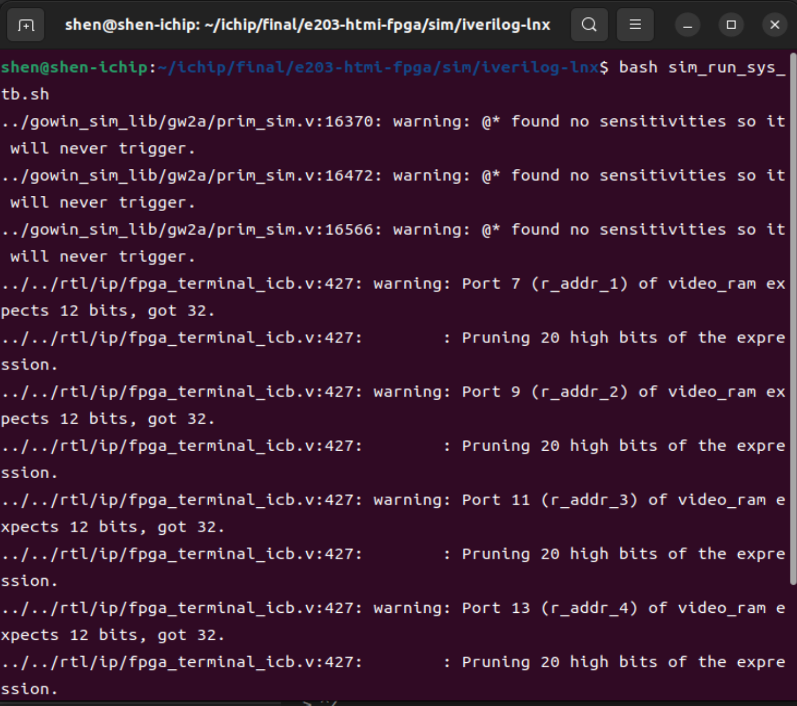
  执行 `bash sim_run_sys_tb.sh`  
  - 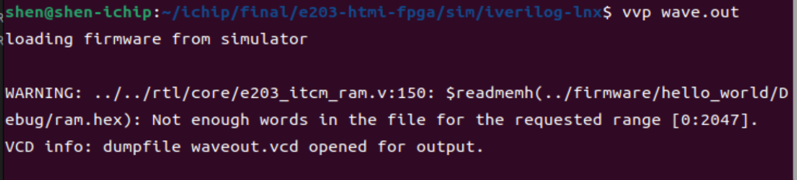
  执行 `vvp wave.out` 生成 VCD  
  - 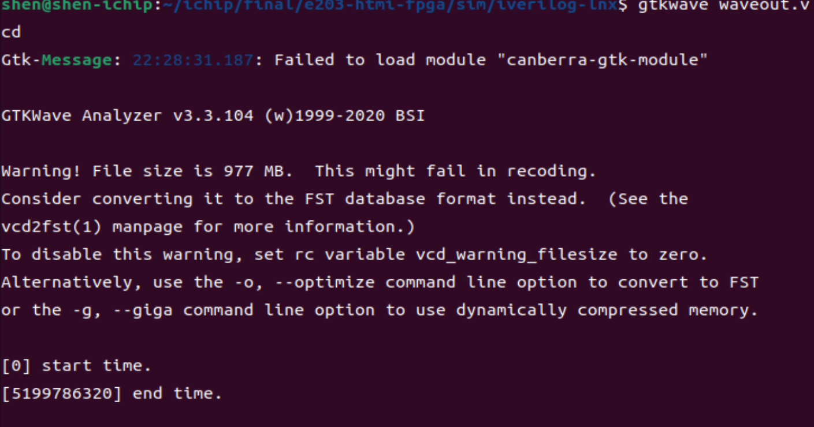
  运行 `gtkwave waveout.vcd`  
  - 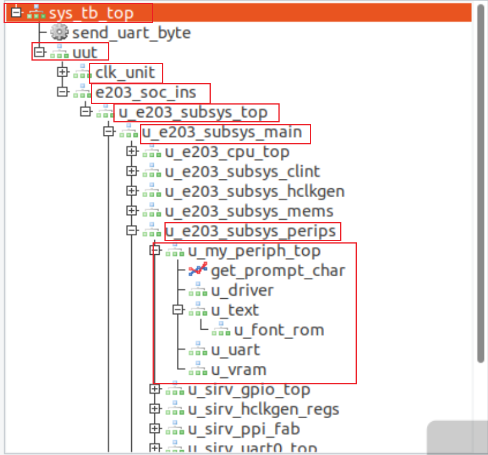
  GTKWave 层级展开示例  
- 仿真波形截图与说明：  
  1) UART 帧（`term_uart_rx` 发送 “A”）：起始位=0，8 数据位 LSB→MSB（0x41），停止位=1，位宽≈8.68µs（115200bps）。  
     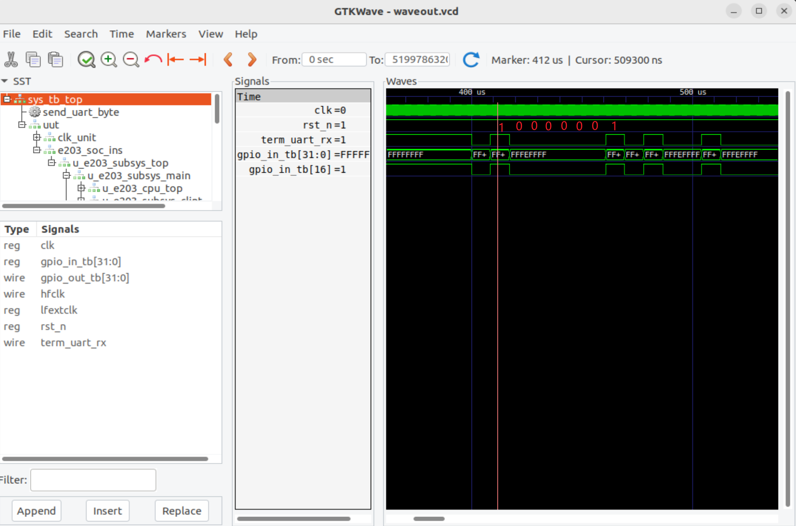  
  2) 显示时序：`lcd_dclk` 连续方波；`lcd_hs` 为低脉冲（行同步，周期≈31.7µs）；`lcd_de` 低有效，长低脉冲对应行内有效区；`lcd_vs` 在本窗口高电平（帧同步低脉冲周期≈16.7ms，当前窗口未落入）。  
     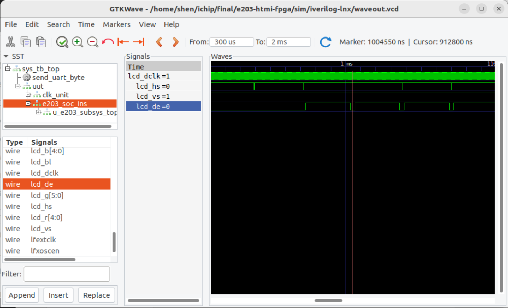  
  3) 彩条→文本切换：`bar_active` 从 1→0，表明彩条结束进入文本模式，同时 `lcd_hs/de/dclk` 时序正常。  
     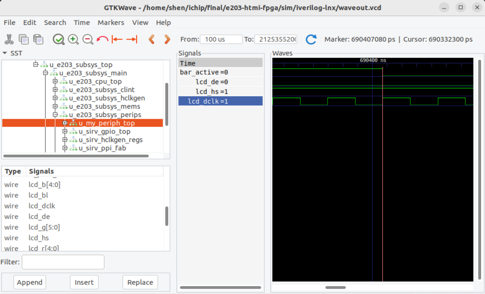

## 运行与验证
1. 选正确 UART COM（非 JTAG），115200 8N1。
2. 观察彩条→信息行→清屏→提示符。
3. 输入 ASCII 字符验证显示、换行、退格；确认无重复/丢字。
4. 异常时检查波特率、单一串口终端、GPIO16 未被占用。

## 测试与仿真建议
- 硬件快速检查：仅 USB-JTAG 即可供电/下载/串口。
- 功能自检：发送 `ABCabc123!?` 等组合验证显示正确。
- 仿真：可在 GTKWave 中查看 ICB/FIFO/光标/显示时序是否与预期一致。

## 参考资料
- `ref/` 目录资料与 Tang Primer 20K 示例项目。
- 原理图：`Tang_Primer_20K_SOM-3961_Schematic.pdf`、`Tang_Primer_20K_Dock-3713_Schematics.pdf`。
- 官方例程：https://github.com/sipeed/TangPrimer-20K-example
- 课程提供的 E203 参考代码与 ICB 文档。

## 演示与运行照片
- 演示视频：`https://pan.baidu.com/s/1yF1l8_YlUiyY_49Oy-yVkg?pwd=dwu7`（提取码：`dwu7`）。
- 运行照片（`img/`）：
  - 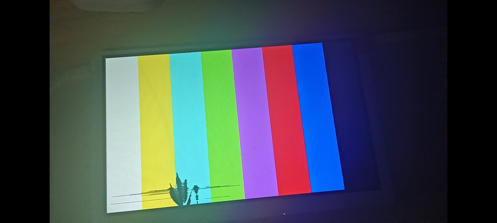
  上电彩条自检。
  - 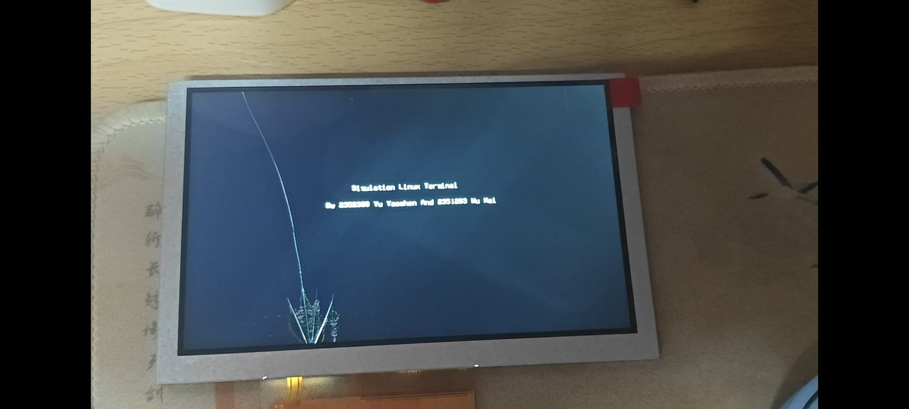
  信息打印阶段。
  - 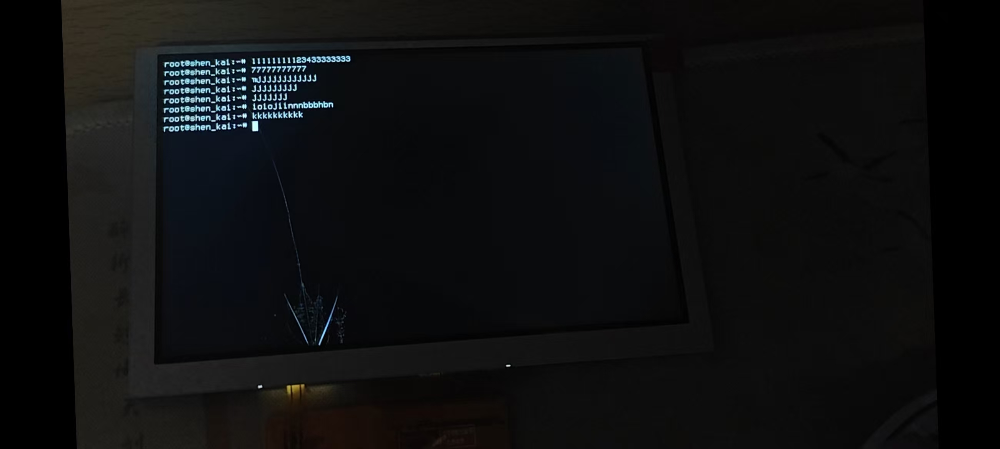
    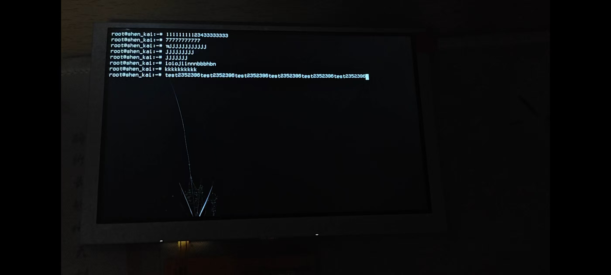
    UART 终端交互演示。
